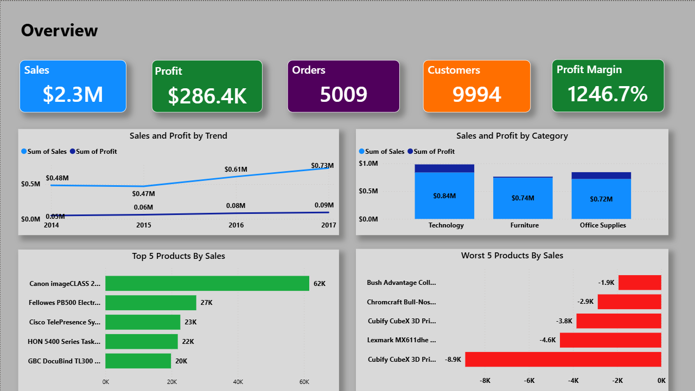
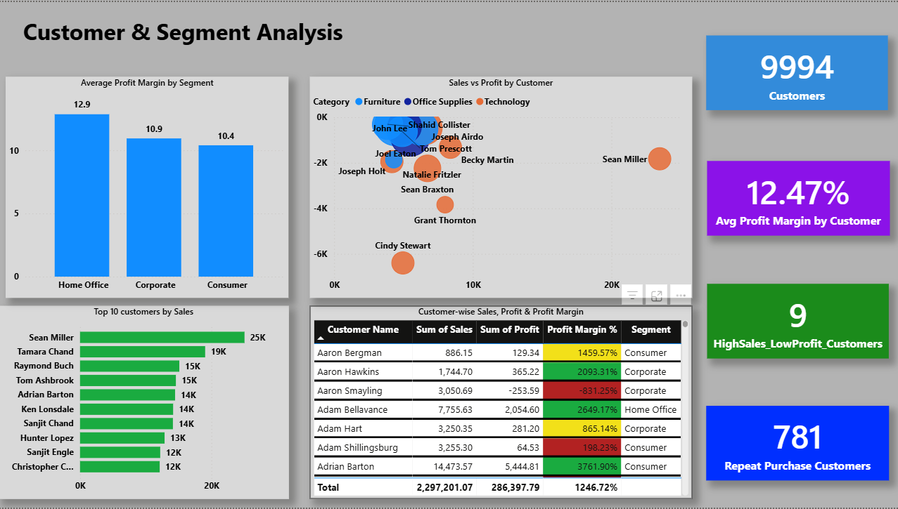
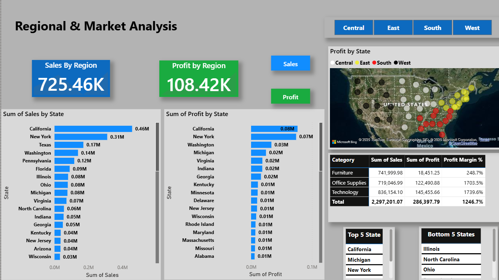
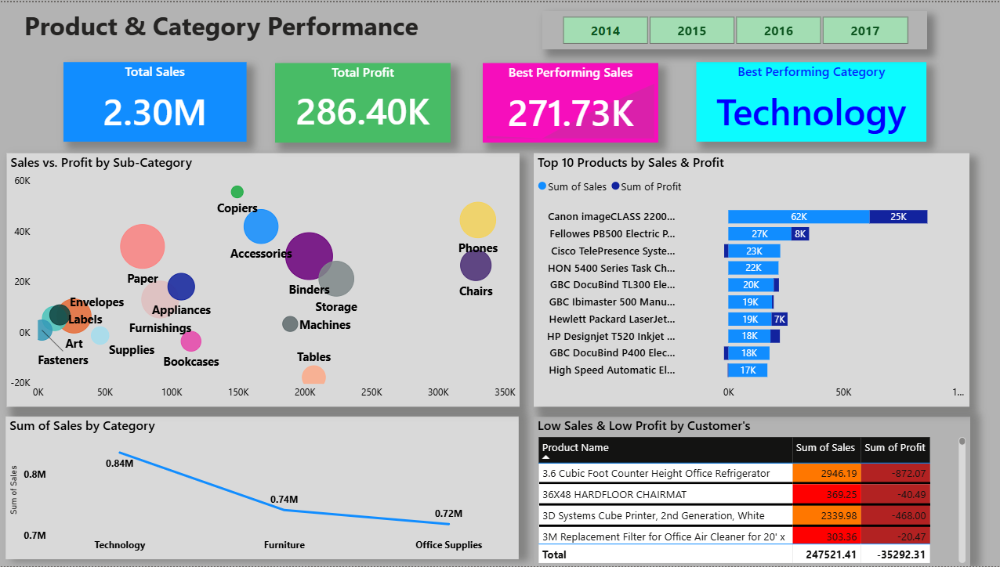
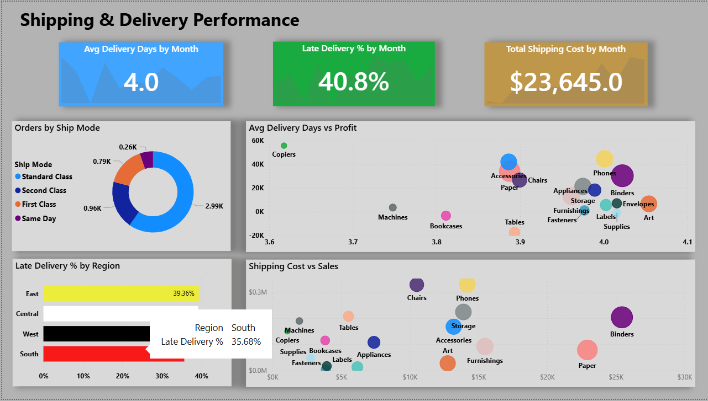

# 📊 Superstore Sales Performance Dashboard

A **Power BI project** analyzing sales, profit, customers, regions, products, and shipping performance of a retail superstore.  
The dashboard provides a **360° view of business performance** with KPIs, trends, and actionable insights.

---

## 🚀 Project Highlights
- **Sales & Profit Overview** — Track revenue and profitability (2014–2017)  
- **Profit & Discount Analysis** — Identify discounting patterns and their effect on margins  
- **Customer & Segment Analysis** — Top customers, repeat buyers, and profitability by segment  
- **Regional & Market Analysis** — Performance across states & regions  
- **Product & Category Performance** — Best vs. low-performing categories/products  
- **Shipping Performance** — Delivery days, late shipments, and shipping cost analysis

---

## 📂 Repository Structure
- `PowerBI_Dashboard/` → Power BI `.pbix` file  
- `Data/` → Raw dataset (`.csv`)  
- `Reports/` → Final PDF report & documentation  
- `Screenshots/` → Dashboard section images  
- `README.md` → Project documentation  

---

## 🖼️ Dashboard Preview
| Overview | Profit & Discount | Customers |
|----------|------------------|-----------|
|  |  |  |

| Regions | Products | Shipping |
|---------|----------|----------|
|  |  |  |

---

## 📊 Tools & Technologies
- **Power BI** (Data Modeling, DAX, Visualization)  
- **Excel / CSV** (Dataset preparation)  
- **GitHub** (Version control & sharing)  

---

## 📈 Key Insights
- **Technology** is the most profitable category, while **Furniture** struggles with margins  
- **California & New York** generate the highest sales, but some states show losses  
- Heavy discounting in **Office Supplies** reduces profitability  
- ~40% of deliveries are **late**, especially in the West region  
- A few customers contribute **high sales but low profit**, signaling pricing inefficiencies  

---

## 📜 License
This project is licensed under the MIT License — see the [LICENSE](LICENSE) file for details.
