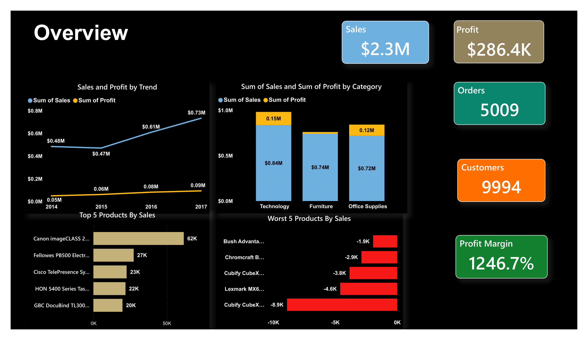
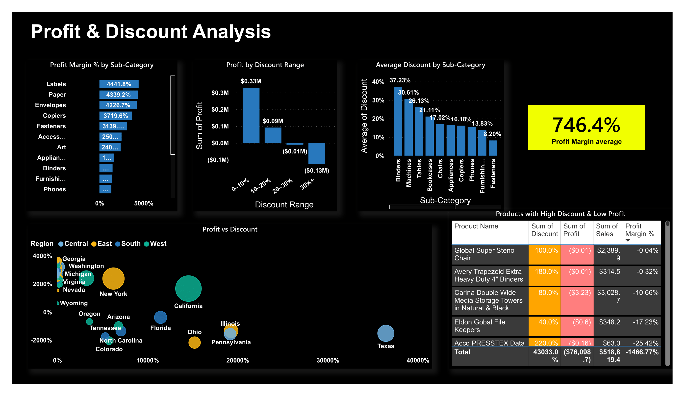
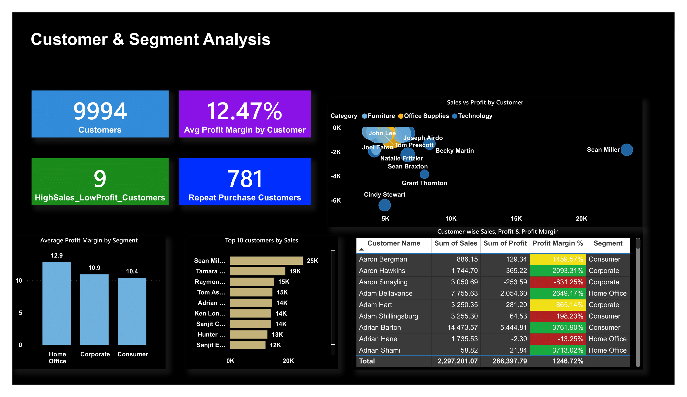
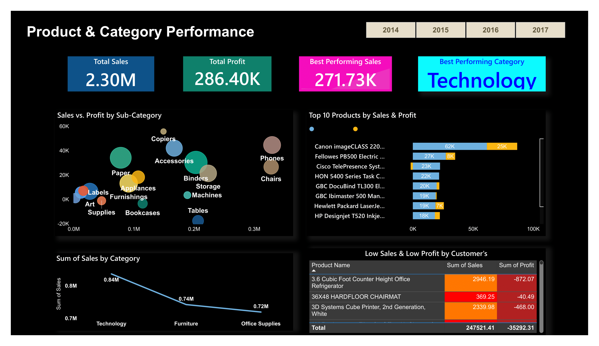
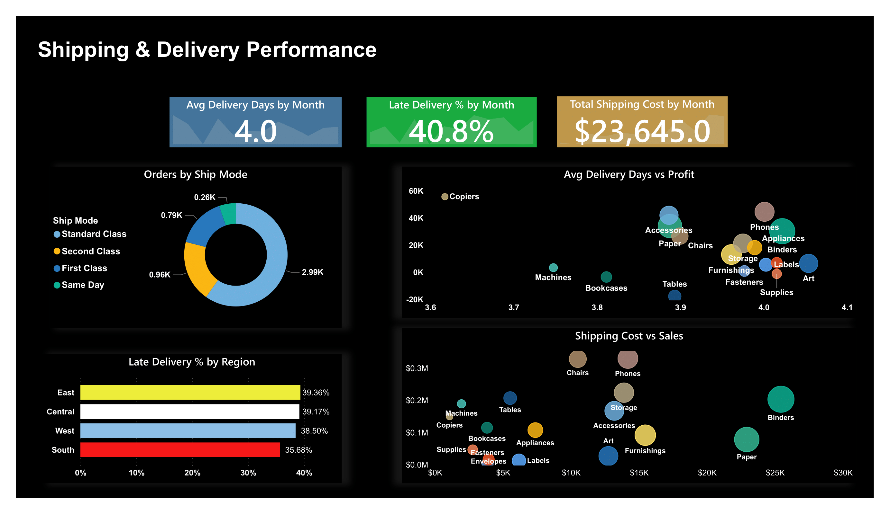
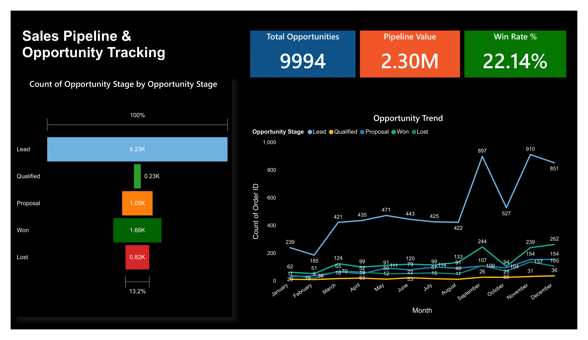

# 📊 Superstore Sales Performance Dashboard

A Power BI project analyzing sales, profit, customers, regions, products, shipping performance, and sales pipeline of a retail superstore.  
The dashboard provides a 360° view of business performance with KPIs, trends, and actionable insights.

---

## 🚀 Project Highlights
- **Sales & Profit Overview** — Track revenue and profitability (2014–2017)  
- **Profit & Discount Analysis** — Identify discounting patterns and their effect on margins  
- **Customer & Segment Analysis** — Top customers, repeat buyers, and profitability by segment  
- **Regional & Market Analysis** — Performance across states & regions  
- **Product & Category Performance** — Best vs. low-performing categories/products  
- **Shipping Performance** — Delivery days, late shipments, and shipping cost analysis  
- **Opportunity Funnel & Sales Pipeline** — Conversion funnel, opportunity stages, and win-rate tracking  

---

## 🖼️ Dashboard Preview
| Overview | Profit & Discount | Customers |
|----------|------------------|-----------|
|  |  |  |

| Regions | Products | Shipping |
|---------|----------|----------|
|  |  |  |

| Opportunity Funnel |
|--------------------|
|  |

---

## 📊 Tools & Technologies
- **Power BI** (Data Modeling, DAX, Visualization)  
- **Excel / CSV** (Dataset preparation)  
- **GitHub** (Version control & sharing)  

---

## 📈 Key Insights
- **Technology** is the most profitable category, while **Furniture** struggles with margins  
- **California & New York** generate the highest sales, but some states show losses  
- Heavy discounting in **Office Supplies** reduces profitability  
- ~40% of deliveries are **late**, especially in the West region  
- A few customers contribute **high sales but low profit**, signaling pricing inefficiencies  
- The **sales funnel win rate is 22%**, indicating room for pipeline improvement  
- Most opportunities drop at the **Proposal stage**, showing a need for better negotiation strategies  

---

## 📜 License
This project is licensed under the MIT License — see the [LICENSE](LICENSE) file for details.
